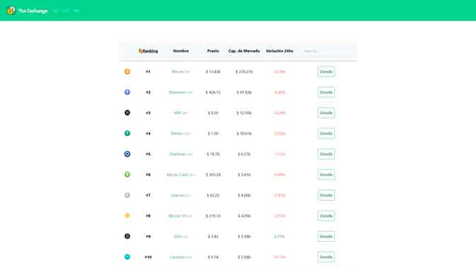

# The exchange (Vue.js)

¡Bienvenido y gracias por visitarme! Este es un proyecto elaborado como proyecto de aprendizaje de Vue.js [Platzi](https://platzi.com/cursos/vuejs/) en donde aplico varios de los conocimientos y habilidades adquiridas, entre ellas:

- Entender las ventajas de Vue.js
- Obtener datos de una API externa
- Hacer despliegue a producción

## Vista de Home



### [Ver Home](https://the-exchange.diegoalesco95.vercel.app/)

## Configuración de proyecto

```
npm install
```

### Compilar y hot-reloads para desarrollo
```
npm run serve
```

### Compilar y minificar para Producción
```
npm run build
```

### Lint y arreglar archivos
```
npm run lint
```

### Personalizar configuraciones
Ver [Configuracion de referencia](https://cli.vuejs.org/config/).

